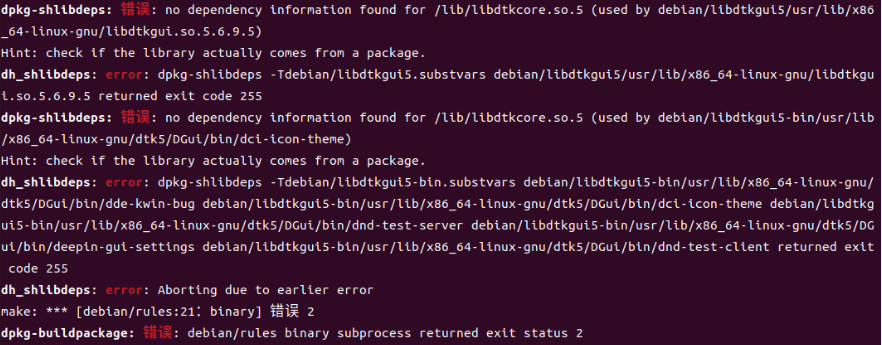

## DTK Dependency Installation

For deepin-unioncode, the required dependency libraries include dtkcore, dtkwidget, dtkgui, and qt5integration, and this section describes the installation of these dependencies.

### 1. Source Code Pull

First you need to download the source code of the dtk dependency library in the [deepin github community](https://github.com/linuxdeepin):

[dtkcore](https://github.com/linuxdeepin/dtkcore)，[dtkwidget](https://github.com/linuxdeepin/dtkwidget)，[dtkgui](https://github.com/linuxdeepin/dtkgui)，[qt5integration](https://github.com/linuxdeepin/qt5integration)

The dtkcore might rely on [dtkcommon](https://github.com/linuxdeepin/dtkcommon)，qt5integration will depend on the [qt5platform-plugins](https://github.com/linuxdeepin/qt5platform-plugins)

### 2. Environmental Installation

First you need to install the qt environment and execute the following command

```shell
sudo apt update
sudo apt install qtbase5-dev qtchooser qt5-qmake qtbase5-dev-tools qttools5-dev qt5-private-dev
```

### 3. DTK Installation

After the source code is pulled down, ensure that the required dependencies are properly installed and execute the following command in the directory location where the source code for each dependency library is located

```shell
sudo apt build-dep .
```

There are two ways to install dtk dependencies, one is the source code installation, and the second is the build-your-own-package installation. The source installation method is described in the README document of the respective dependent libraries, and will not be repeated here. This section describes how to install using a software package:

In the source root of the respective dependent library, use the following command to package

```shell
dpkg-buildpackage -us -uc -b -j16
```

"-j16" Specifies the parameter for multi-core execution, which can be increased or decreased according to the number of processor cores and performance.

The following errors may occur when installing dependent libraries:



Cause: The dependent version failed to be properly packaged

The solution:

```shell
vim debian/rules
# Find "override_dh_shlibdeps:" in the opened file
# Add "dh_shlibdeps -- dpkg-shlibdps-params =--ignore-missing-info"
```


After all dependencies are successfully packaged, you can use the installation package to install the dependencies. After the installation, run commands to check whether the dependencies are successfully installed and whether their versions meet requirements.

```shell
apt policy libdtkcore5
# Other dependencies are viewed in the same way
```
